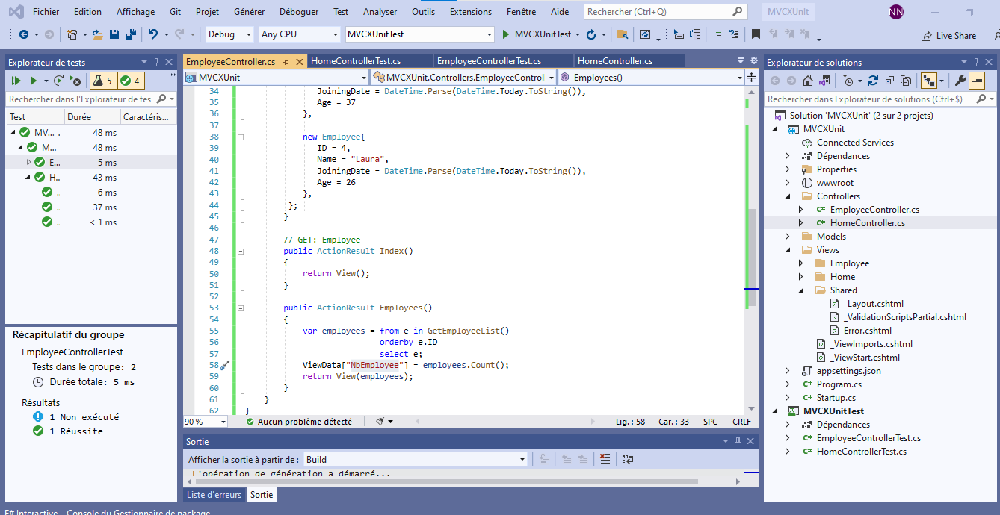

# Implement Unit Testing in ASP.NET MVC

### Content - :
xUnit.net
xUnit.net is the newest unit testing framework for .NET projects and
gained lots of popularity when Microsoft started using it for ASP.NET 
Core.
xUnit.net can be used to implement unit testing in ASP.NET Core &
.NET Full framework as well. 
 

### `Screen shot`
 
 
  
  

